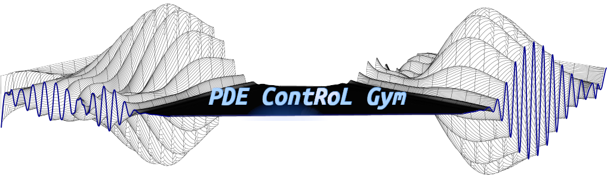

## About
[PDE Control Gym](https://github.com/lukebhan/PDEControlGym) is the first open benchmark that lets model-free RL control representative Partial Differential Equations (PDEs) from their boundaries, such as 2D Navier-stokes flow. While Proximal Policy Optimization (PPO) does work, it requires millions of steps and still shows unstable, oscillating behavior. We found that this is because the reward does not reflect the physical property of the PDE. 

In **PINN-PPO**, we add a lightweight Physics-Informed Neural Network (PINN) residual term to the reward, keeping the agent model-free yet physics-aware. This provides real-time PDE-error feedback, guiding the agent towards faster convergence with improved stability.

## Getting Started
1. `pip install -e .` : Install dependencies
2. `cd pde_control_gym` : Navigate to the working directory
3. Train/visualize the models.
   - `python 1_train_time_control_pinn.py` : Train the PINN agent for time-dependent control
   - `python 2_ppo_with_pinn_env.py` : Train the PINN-PPO agent
   - `python 3_compare_pinn_vs_standalone_ppo.py` : Evaluate and compare the trained PINN-PPO and standalone PPO agents

## Data Interpretation
After training, multiple windows with useful diagrams will pop up (also automatically saved in the `pde_control_gym` directory). 
 
### Field diagrams
Visualizes the controlled Navier-Stokes flow (u, v, p) for each timestamp. Ideally, the flow should be stable and symmetrical, and respect the boundary conditions (e.g. velocity along x = 0, 1 should be zero).

### Control action comparison graph
Compares the control effort (`action[0]`) for each timestamp. In practice, higher absolute values of the control action is undesirable as it indicates more effort to control the physical system.

### State variable evolution graph
Visualizes the state variables over time. 

## Contributors
- Hyojin Kim (김효진, 20255127)
- Chankyu Lee (이찬규, 20190514)
- Minjoon Jeong (정민준, 20230654)
- Dongheon Han (한동헌, 20220722)
- Eungi Hong (홍은기, 20210698)

## [Original Repository](https://github.com/lukebhan/PDEControlGym)

